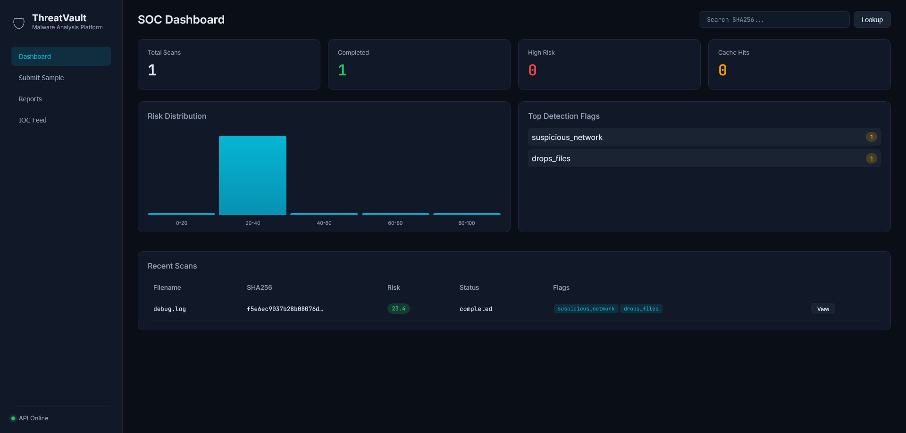
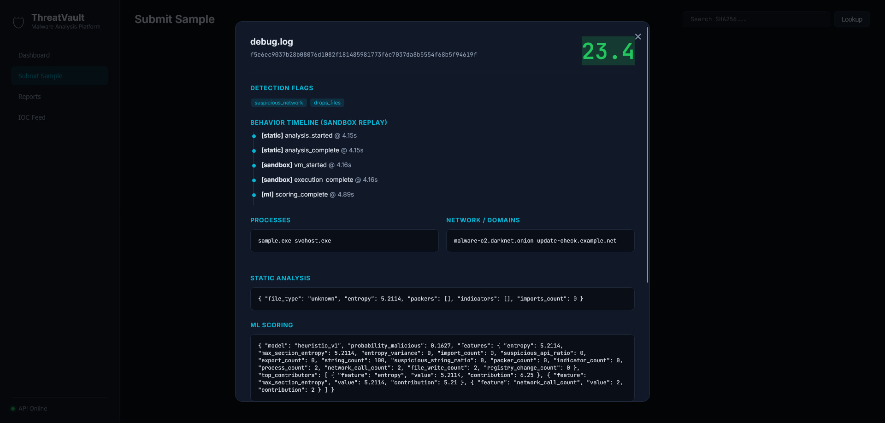

# ThreatVault

**Платформа анализа malware** — статический анализ, sandbox, ML-скоринг и отчёты уровня SOC.

> Часть security-платформы: **SentinelX** (агент) · **LogForge** (SIEM) · **ThreatVault** (анализ malware)

```
[Upload API] → [Static Analyzer] → [Sandbox Executor] → [ML Scoring] → [Report DB] → [Web UI]
```

## Возможности

| Модуль | Что умеет |
|--------|-----------|
| **Static Analysis** | PE/ELF headers, entropy, strings, imports/exports, детект packer'ов |
| **Sandbox** | Process tree, сетевые вызовы, запись файлов, изменения реестра (simulation mode) |
| **ML Engine** | Feature extraction (entropy, opcode freq, API calls) + классификатор XGBoost/LightGBM |
| **YARA** | Движок правил (pattern-based fallback; нативный YARA — опционально) |
| **Cache** | Кэш результатов по SHA256 (Redis или in-memory fallback) |
| **Workers** | Распределённые sandbox-воркеры через Celery + Redis |

## Скриншоты




## Быстрый старт

```bash
# Backend
cd backend
python -m venv .venv
.venv\Scripts\activate      # Windows
pip install -r requirements.txt
uvicorn app.main:app --reload --port 8000

# Worker (опционально, отдельный терминал)
celery -A app.workers.celery_app worker -l info -Q sandbox,static

# Frontend — открыть http://localhost:8000 (отдаётся через FastAPI)
```

Или двойной клик по `start.bat` в корне проекта — скрипт сам создаст venv, установит зависимости и запустит сервер. При ошибке окно **не закроется**, а текст ошибки будет в `logs\startup.log`.

### Логи

Все логи сохраняются в папку `logs/`:

| Файл | Содержимое |
|------|------------|
| `startup.log` | Запуск через start.bat (venv, pip install) |
| `threatvault.log` | Основной лог приложения (сканы, pipeline) |
| `access.log` | HTTP-запросы (метод, путь, время) |
| `error.log` | Только ошибки (ERROR+) |

Логи ротируются автоматически (до 10 MB × 5 файлов). Уровень логирования: `THREATVAULT_LOG_LEVEL=DEBUG` в `.env`.

> **Windows:** если `pip install` падает на `yara-python` — это нормально, пакет убран из обязательных зависимостей. YARA работает через fallback. Для нативного YARA: установи [C++ Build Tools](https://visualstudio.microsoft.com/visual-cpp-build-tools/) и `pip install -r requirements-yara.txt`.

### Docker

```bash
docker compose up -d
# API: http://localhost:8000
# Dashboard: http://localhost:8000
```

## API

| Метод | Endpoint | Описание |
|-------|----------|----------|
| `POST` | `/api/v1/scan` | Загрузить файл на полный pipeline анализа |
| `POST` | `/api/v1/submit-sample` | Отправить образец (alias для scan) |
| `GET` | `/api/v1/report/{id}` | Получить отчёт по ID сканирования |
| `GET` | `/api/v1/report/hash/{sha256}` | Поиск по хешу файла |
| `GET` | `/api/v1/stats` | Статистика платформы |
| `GET` | `/api/v1/ioc/{id}` | Извлечённые IOC из отчёта |

### Пример

```bash
curl -X POST http://localhost:8000/api/v1/scan -F "file=@sample.exe"
curl http://localhost:8000/api/v1/report/{scan_id}
```

### Схема отчёта

```json
{
  "risk_score": 87,
  "flags": ["injects_process", "suspicious_network", "obfuscated_strings"],
  "behavior": {
    "processes": ["cmd.exe", "powershell.exe"],
    "domains": ["evil-c2.example.com"]
  }
}
```

## Архитектура

```
backend/
├── app/
│   ├── api/           # FastAPI routes
│   ├── core/          # Config, cache, database
│   ├── models/        # Pydantic schemas
│   ├── services/
│   │   ├── static/    # PE/ELF analyzer
│   │   ├── sandbox/   # VM executor + behavior capture
│   │   ├── ml/        # Feature extraction + classifier
│   │   └── yara/      # YARA rules engine
│   └── workers/       # Celery distributed workers
frontend/              # SOC dashboard (SPA)
rules/                 # YARA detection rules
docker/                # Container definitions
```

## ML-слой

Обучение модели или использование встроенного heuristic fallback:

```bash
python -m app.services.ml.train --samples ./samples
```

Признаки: entropy, variance entropy секций, количество imports, доля подозрительных API, score обфускации строк, индикаторы packer'ов.

## Безопасность

ThreatVault предназначен для **авторизованного анализа malware** в изолированных lab-средах. Никогда не запускайте неизвестные образцы на production-системах. Sandbox в текущей версии работает в **simulation mode** — безопасно для демо и портфолио. В production-деплое подключайте реальную VM-изоляцию (KVM/QEMU, Cuckoo и т.д.).

## Лицензия

MIT

---

## Roadmap → v2.0

Цель релиза 2.0 — превратить ThreatVault из demo/portfolio-платформы в **production-ready malware analysis engine**, интегрируемый с SentinelX и LogForge.

### Sandbox & Execution

- [ ] **Real VM isolation** — интеграция с KVM/QEMU или Cuckoo Sandbox вместо simulation mode
- [ ] **Multi-OS profiles** — Windows 10/11, Linux (Ubuntu), macOS sandbox-образы
- [ ] **Network capture (PCAP)** — полный дамп трафика с автоматическим извлечением C2/beacon-паттернов
- [ ] **Memory dump analysis** — Volatility3 plugin для post-mortem анализа процессов и инъекций
- [ ] **Screenshot + video replay** — покадровый replay поведения в UI с timeline scrubber

### Static Analysis

- [ ] **Mach-O / APK / PDF / Office** — расширение парсеров за пределы PE/ELF
- [ ] **Capa rules integration** — MITRE ATT&CK mapping из capability-анализа
- [ ] **Unpacking pipeline** — автоматическая распаковка UPX/ASPack/VMProtect перед анализом
- [ ] **Diff engine** — сравнение двух версий одного семейства malware (binary diff + behavior diff)

### ML & Detection

- [ ] **Production ML pipeline** — автоматическое переобучение на labeled dataset с versioning моделей
- [ ] **Embedding-based similarity** — поиск похожих образцов по feature vectors (FAISS / pgvector)
- [ ] **Ensemble scoring** — комбинация static + sandbox + YARA + ML в единый calibrated risk score
- [ ] **False-positive feedback loop** — аналитик помечает FP → модель дообучается

### Platform & Integration

- [ ] **STIX/TAXII 2.1 export** — автоматический экспорт IOC в формате для SIEM (LogForge) и TIP
- [ ] **SentinelX agent feed** — push reputation по хешам на endpoint-агенты в реальном времени
- [ ] **Webhook & API keys** — async scan с callback, rate limiting, RBAC для multi-tenant
- [ ] **Hunting queries** — pre-built YARA/Sigma-запросы для threat hunting по базе образцов

### Infrastructure

- [ ] **PostgreSQL + Elasticsearch** — миграция с SQLite, полнотекстовый поиск по strings/behavior
- [ ] **Horizontal scaling** — auto-scaling sandbox workers по очереди (Kubernetes Helm chart)
- [ ] **Sample storage (S3/MinIO)** — deduplicated blob storage с retention policies
- [ ] **Audit log & compliance** — кто загрузил образец, chain of custody, GDPR-ready data deletion

### UI / SOC Dashboard

- [ ] **Collaborative reports** — комментарии аналитиков, теги семейств, MITRE heatmap
- [ ] **Graph view** — визуализация process tree и network connections как interactive graph
- [ ] **Bulk upload & batch API** — массовая загрузка образцов с progress tracking
- [ ] **Dark/light theme + i18n** — локализация RU/EN для SOC-команд

### Target Metrics (v2.0)

| Метрика | v1.0 (сейчас) | v2.0 (цель) |
|---------|---------------|-------------|
| Время полного анализа | ~3–5 сек (simulation) | < 3 мин (real VM) |
| Форматы файлов | PE, ELF | + Mach-O, APK, PDF, Office, scripts |
| Sandbox | Simulation | Real VM + PCAP + memory dump |
| ML | Heuristic + optional XGBoost | Production pipeline + similarity search |
| Интеграции | Standalone | SentinelX + LogForge + STIX/TAXII |
