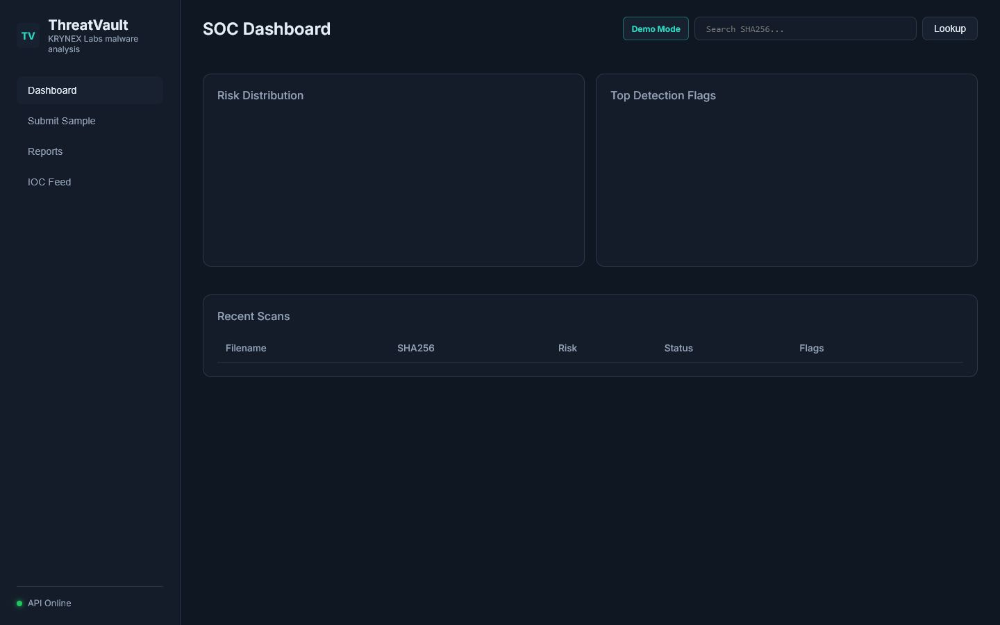

# ThreatVault V1.1

Defensive file analysis dashboard for static indicators, simulated sandbox behavior, YARA matches and IOC review.

## Product Overview

ThreatVault is the KRYNEX Labs public MVP for malware-analysis-style reporting in a safe demo context. It accepts samples, generates static and simulated behavior reports, and presents risk, YARA and IOC information in a SOC dashboard. The public version does not claim real production sandbox isolation.

## Key Features

- Sample submission and report lookup.
- Static metadata and suspicious indicator reporting.
- Simulated sandbox behavior timeline.
- YARA fallback matching.
- Demo mode with clear dashboard badge and public-safe config.

## Architecture

FastAPI serves the API and static frontend. SQLite is the default demo database. Redis/Celery can be used for worker-style analysis queues. The sandbox layer is simulation-oriented in the public MVP.

## Tech Stack

- Frontend: HTML, CSS, vanilla JavaScript
- Backend: FastAPI, SQLAlchemy, Pydantic
- Workers: Celery, Redis
- Analysis: static parser, YARA/fallback rules, heuristic ML scoring

## Screenshots



| List view | Detail view | Settings |
| --- | --- | --- |
|  |  |  |

## Quick Start

```bash
cp .env.example .env
cd backend
python -m venv .venv
.venv\Scripts\activate
pip install -r requirements.txt
uvicorn app.main:app --reload --port 8000
```

Dashboard: <http://localhost:8000>  
API docs: <http://localhost:8000/docs>

## Demo Mode

Set `THREATVAULT_DEMO_MODE=true`. Demo mode is public-safe and does not require auth, SMTP or external credentials. Reports are local demo artifacts only.

## Public Demo Readiness

- Keep uploaded samples limited to benign test files in public environments.
- Mark sandbox behavior as simulated in screenshots, copy and API notes.
- Rotate or clear local report artifacts between hosted demo sessions.
- Avoid exposing worker queues or model files in public demo deployments.

## Environment Variables

Use `.env.example`. Do not commit private `.env`, uploads, databases or trained model files. Important variables include `THREATVAULT_DEMO_MODE`, `THREATVAULT_DATABASE_URL`, `THREATVAULT_REDIS_URL`, `THREATVAULT_ENABLE_*` and Celery URLs.

## API Overview

- `POST /api/v1/scan` - submit a file for local demo analysis.
- `GET /api/v1/report/{id}` - fetch a report.
- `GET /api/v1/report/hash/{sha256}` - lookup by hash.
- `GET /api/v1/stats` - dashboard stats.
- `GET /health` - health check.

## Project Structure

```text
backend/      FastAPI app and analysis services
frontend/     Static dashboard
rules/        YARA rules
docker/       Container config
scripts/      Demo helpers
```

## Security Scope

ThreatVault is defensive-only. It must not include malware, credential theft, stealth, persistence, AV bypass, exploit delivery, unauthorized remote control or destructive behavior. Public sandbox behavior is simulation mode, not real isolation.

## Roadmap

- Add richer benign demo sample metadata.
- Add report comparison views.
- Add STIX/TAXII export planning.
- Add read-only hosted demo mode.
- Add real isolated sandbox integration only in private production research.

## KRYNEX Ecosystem

ThreatVault complements SentinelX endpoint telemetry, LogForge log management and VulnScope exposure management.

## License

MIT.
<!-- Project version: ThreatVault V1.1 -->
